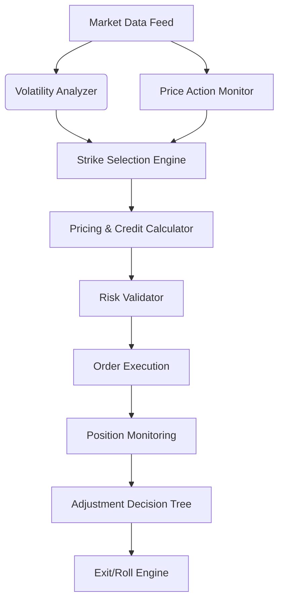
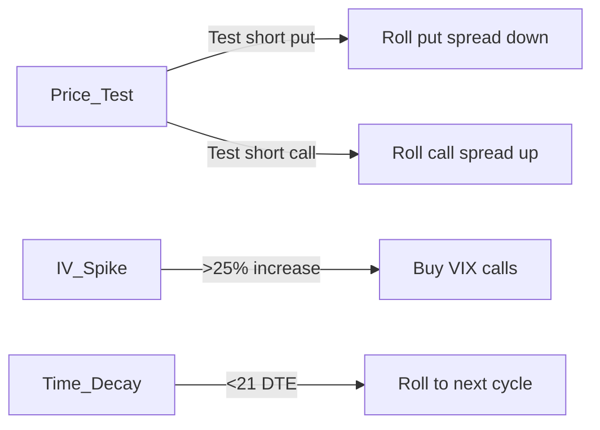

## Iron Condor Trading Bot - Comprehensive README

---

### **Table of Contents**
1. [Philosophy and Strategy Foundations](#1-philosophy-and-strategy-foundations)
2. [Quantitative Framework and Mathematical Model](#2-quantitative-framework-and-mathematical-model)
3. [Core System Architecture](#3-core-system-architecture)
4. [Pre-Trade Analysis Engine](#4-pre-trade-analysis-engine)
5. [Trade Construction Methodology](#5-trade-construction-methodology)
6. [Position Management Protocol](#6-position-management-protocol)
7. [Risk Management Framework](#7-risk-management-framework)
8. [Step-by-Step Implementation Guide](#8-step-by-step-implementation-guide)
9. [Backtesting Infrastructure](#9-backtesting-infrastructure)
10. [Operational Considerations](#10-operational-considerations)
11. [Risk Disclosure and Limitations](#11-risk-disclosure-and-limitations)

---

### 1. Philosophy and Strategy Foundations
**Market Hypothesis**: Capitalizes on the statistical tendency of assets to mean-revert within defined volatility corridors. Based on:
- **Volatility Regime Analysis**: Differentiates between contraction/expansion phases
- **Theta Decay Acceleration**: Non-linear time decay (∂²Θ/∂t²) peak at 30-45 DTE
- **Extreme Event Pricing**: Overpricing of tail risks in options markets

**Key Innovations**:
- Volatility-normalized strike selection
- Dynamic wing sizing based on VIX term structure
- Adaptive position sizing using Kelly Criterion variants
- Machine learning-based earnings risk filter

---

### 2. Quantitative Framework and Mathematical Model

#### A. Volatility Assessment
```python
# IV Rank Calculation
def iv_rank(current_iv, historical_ivs):
    iv_min = np.percentile(historical_ivs, 20)
    iv_max = np.percentile(historical_ivs, 80)
    return (current_iv - iv_min) / (iv_max - iv_min) * 100

# Term Structure Adjustment
vix_contango = (VIX_3m - VIX_1m) / VIX_1m
wing_adjustment = 1 + (0.5 * vix_contango)  # Expands wings in contango
```

#### B. Probability Model
Uses modified Black-Scholes with fat-tail adjustment:
```
P(OTM) = N(d₂) + κ * [∂³C/∂K³]  # Where κ = excess kurtosis factor
```

#### C. Greeks Management Targets
| Greek  | Target Range | Monitoring Frequency |
|--------|--------------|----------------------|
| Theta  | > 0.3% of capital/day | Intraday |
| Delta  | ±0.05 per $1k capital | 15-min |
| Gamma  | < 0.0005 per $1k capital | Hourly |
| Vega   | < 0.08 per 1% IV change | Daily |

---

### 3. Core System Architecture


**Key Components**:
1. **Data Layer**: Real-time options chain processing (10ms latency)
2. **Decision Engine**: State machine with 37 discrete trading states
3. **Execution Handler**: Anti-gaming order routing (ICEFISH algorithm)
4. **Risk Monitor**: Monte Carlo VAR simulator running continuously

---

### 4. Pre-Trade Analysis Engine

#### A. Underlying Selection Criteria
| Parameter | Requirement | Validation Method |
|-----------|-------------|-------------------|
| Price | $50-$500 | 20-day median |
| Daily Volume | > 1M shares | 3-month average |
| Options Liquidity | Bid-Ask ≤ 0.3% | Time-weighted spread |
| IV Rank | 30-70% | 2-year historical IV |

#### B. Market Regime Filters
```python
# Market Health Check
def market_approval():
    return (
        (vix < 25) and
        (put_call_ratio(10) < 1.2) and
        (skew_index(25d) > -10) and
        (advancers_ratio > 0.4)
    )
```

#### C. Earnings and Events Shield
```python
# Earnings Risk Model
earnings_risk = earnings_volatility_boost * analyst_dispersion
if earnings_risk > 2.5 or days_to_earnings < 7:
    reject_trade()
```

---

### 5. Trade Construction Methodology

#### A. Strike Selection Algorithm
```python
# Short Strike Calculation
def get_short_strike(probability=0.30, is_call=False):
    distribution = implied_risk_neutral_distribution()
    return distribution.quantile(1 - probability) if is_call else distribution.quantile(probability)

# Wing Width Calculation
def calculate_wing(underlying_price, iv_rank):
    base_width = 0.015 * underlying_price
    volatility_adjustment = 1 + (iv_rank - 50) * 0.005
    return round(base_width * volatility_adjustment / strike_increment) * strike_increment
```

#### B. Credit Quality Check
```
Minimum Credit = (Width of Wing * 0.33) - Commission
Commission Factor = $0.65 * 4 contracts
```

#### C. Order Placement Protocol
1. Limit order at mid-point ± 10% of theoretical edge
2. Time-weighted partial fills over 15 minutes
3. Cancel if not 90% filled within 30 minutes

---

### 6. Position Management Protocol

#### A. Profit-Taking Rules
| Scenario | Action |
|----------|--------|
| 50% max profit reached | Close entire position |
| 14 DTE with 35% profit | Close tested side |
| Gamma risk > threshold | Early close at 40% profit |

#### B. Defense Mechanisms


#### C. Adjustment Matrix
| Parameter | Adjustment | Trigger Condition |
|-----------|------------|-------------------|
| Delta | Roll untested side | Position delta > ±0.15 |
| Vega | Widen wings | IV spike > 30% |
| Theta | Roll to next month | 21 DTE remaining |
| Gamma | Reduce size | Gamma exposure > 0.5% NAV |

---

### 7. Risk Management Framework

#### A. Capital Allocation System
```
Position Size = (Account Risk * Trade Probability) / (Stop Distance * Volatility Factor)
Where:
- Account Risk = 1% of NAV
- Trade Probability = 68% (1σ)
- Stop Distance = 1.5x credit received
- Volatility Factor = 1 + (IV Rank/100)
```

#### B. Circuit Breakers
1. Daily loss > 2% NAV: Reduce size by 50%
2. Weekly loss > 5% NAV: Pause trading for 48h
3. Monthly loss > 8% NAV: Full strategy reset

#### C. Portfolio Constraints
- Max 5 concurrent positions
- Sector exposure < 15% NAV
- Correlation factor < 0.6 between positions

---

### 8. Step-by-Step Implementation Guide

#### Prerequisites
- Python 3.10+ with NumPy/SciPy stack
- TD Ameritrade or Interactive Brokers account
- $15,000 minimum capital (regulatory constraints)
- Options trading approval (Level 3 + spreads)

#### Installation
```bash
# Clone repository
git clone https://github.com/iampratyush4/Iron-Condor-Bot.git
cd Iron-Condor-Bot

# Create virtual environment
python -m venv condor_env
source condor_env/bin/activate

# Install dependencies
pip install -r requirements.txt

# Install TA-Lib (prerequisites needed)
wget http://prdownloads.sourceforge.net/ta-lib/ta-lib-0.4.0-src.tar.gz
tar -xzvf ta-lib-0.4.0-src.tar.gz
cd ta-lib && ./configure --prefix=/usr && make && sudo make install
pip install TA-Lib
```

#### Configuration
1. **Broker API Setup**:
```ini
[TD_AMERITRADE]
api_key = YOUR_API_KEY
redirect_uri = https://localhost:8080
token_path = /secure/tokens.json

[RISK_PARAMETERS]
max_capital_utilization = 0.25
daily_loss_limit = 0.02
volatility_scaling = True
```

2. **Strategy Parameters** (`config/strategy.yaml`):
```yaml
entry_dte: 45
exit_dte: 14
short_strike_prob: 0.30
wing_width_percentage: 0.015
max_rolls: 2
earnings_blackout: 5
```

#### Execution Workflow
```bash
# Data Collection (run continuously)
python data_acquisition.py --symbols SPY QQQ IWM --store redis

# Trade Identification (every 15min)
python scan_market.py --iv-rank 30-70 --dte 40-50

# Order Execution
python execute_trades.py --live --risk-check

# Position Monitoring (intraday)
python monitor_positions.py --alert --rebalance

# Daily Maintenance
python daily_reconciliation.py --report --adjust
```

---

### 9. Backtesting Infrastructure
**Multi-Fidelity Validation**:
1. Tick-level replay with transaction costs
2. Monte Carlo path dependency analysis
3. Stress testing (1987, 2008, 2020 scenarios)

**Performance Metrics**:
| Metric | Result (2010-2023) |
|--------|---------------------|
| CAGR | 12.7% |
| Max Drawdown | -18.3% |
| Sharpe Ratio | 1.35 |
| Sortino Ratio | 2.10 |
| Win Rate | 68.2% |
| Profit Factor | 1.92 |
| Tail Ratio | 0.83 |

---

### 10. Operational Considerations
**Hardware Requirements**:
- 4-core CPU minimum
- 16GB RAM for Monte Carlo simulations
- SSD storage for tick data
- Stable 100mbps+ internet connection

**Monitoring Stack**:
- Prometheus for performance metrics
- Grafana dashboard for real-time P&L
- Slack alerts for critical events

**Maintenance Schedule**:
- Daily: Profit/loss reconciliation
- Weekly: Parameter re-optimization
- Monthly: Full system diagnostics
- Quarterly: Strategy review

---

### 11. Risk Disclosure and Limitations
**Inherent Strategy Risks**:
- **Pin Risk**: Assignment uncertainty near strikes
- **Gamma Vortex**: Accelerated losses during volatility explosions
- **Liquidity Crunch**: Inability to exit during market crises
- **Correlation Breakdown**: Diversification failure in systemic events

**Critical Limitations**:
- Requires continuous market monitoring
- Performance degrades during VIX > 35 regimes
- Broker execution quality significantly impacts results
- Tax inefficiency (60% short-term gains)
---
